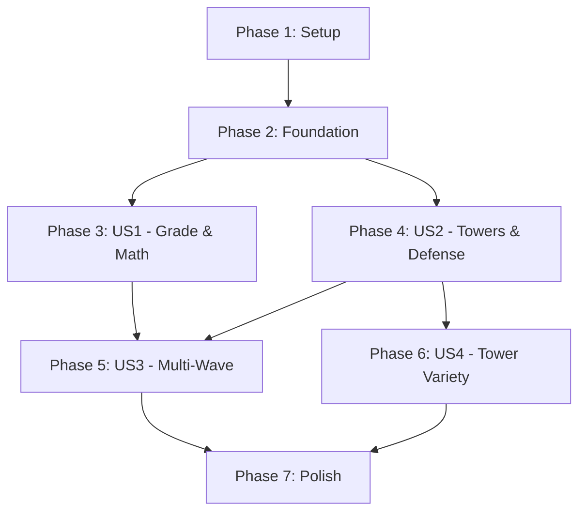

# Tasks: Math Tower Defense Game

**Input**: Design documents from `/specs/001-math-tower-defense/`
**Prerequisites**: plan.md ✅, spec.md ✅, research.md ✅, data-model.md ✅, contracts/ ✅

**Tests**: Tests are OPTIONAL per constitution - only included where educational validation is critical.

**Organization**: Tasks grouped by user story to enable independent implementation and testing of each story.

## Format: `- [ ] [ID] [P?] [Story?] Description`

- **[P]**: Can run in parallel (different files, no dependencies)
- **[Story]**: Which user story this task belongs to (e.g., US1, US2, US3, US4)
- Include exact file paths in descriptions

---

## Phase 1: Setup (Shared Infrastructure)

**Purpose**: Project initialization and basic structure

- [ ] T001 Create directory structure: src/game/entities/{towers,enemies,projectiles}, src/game/systems, src/game/data, src/game/types, tests/math-tower-defense, public/assets/math-tower-defense/{towers,enemies,projectiles,ui,grid}
- [ ] T002 [P] Create TypeScript type definitions in src/game/types/GameTypes.ts (Grade, GameSession, CoinBalance types)
- [ ] T003 [P] Create TypeScript type definitions in src/game/types/TowerTypes.ts (Tower, TowerType enum, TowerStats, PlacedTowerData interfaces)
- [ ] T004 [P] Create TypeScript type definitions in src/game/types/EnemyTypes.ts (Zombie, ZombieStats, WaveConfig interfaces)
- [ ] T005 [P] Create TypeScript type definitions in src/game/types/GridTypes.ts (GridCell, CellType enum, GridPosition, ScreenPosition interfaces)
- [ ] T006 [P] Create Danish text constants in src/game/data/danishText.ts (all UI strings: "Klasse 0-3", "Løs opgaven:", "Rigtigt!", "Prøv igen!", "Mønter:", etc.)
- [ ] T007 [P] Add placeholder assets to public/assets/math-tower-defense/ (temporary colored rectangles for towers, zombies, projectiles, grid tiles)

---

## Phase 2: Foundational (Blocking Prerequisites)

**Purpose**: Core infrastructure that MUST be complete before ANY user story can be implemented

**⚠️ CRITICAL**: No user story work can begin until this phase is complete

- [ ] T008 Create GameSession singleton in src/game/systems/GameSession.ts (grade, coins, currentWave, baseHealth, placedTowers[] properties with getters/setters)
- [ ] T009 [P] Create Grid system in src/game/entities/Grid.ts (15x10 grid with cellSize=64, cells[][], path[], spawnPoint, basePoint, isValidPlacement(), getTowerAt(), placeTower(), screenToGrid(), gridToScreen() methods)
- [ ] T010 [P] Create GridCell class in src/game/entities/GridCell.ts (type: CellType, position: GridPosition, tower: Tower | null, screenPosition, sprite properties)
- [ ] T011 [P] Create level layout configuration in src/game/data/levelLayout.ts (define 15x10 grid dimensions, straight path from left to right, spawn point at [5, 0], base point at [5, 14])
- [ ] T012 Update MainMenu scene in src/game/scenes/MainMenu.ts to add "Start Spil" button that transitions to GradeSelection scene

**Checkpoint**: Foundation ready - user story implementation can now begin in parallel

---

## Phase 3: User Story 1 - Grade Selection & First Math Challenge (Priority: P1) 🎯 MVP

**Goal**: Children can select grade (0-3) and solve their first math problem to earn coins

**Independent Test**: Launch game → select grade 1 → see grade-appropriate problem (e.g., 2+3=?) → answer correctly → receive 10 coins

### Implementation for User Story 1

- [ ] T013 [P] [US1] Create GradeSelection scene in src/game/scenes/GradeSelection.ts (background, title "Vælg din Klasse", four grade buttons "Klasse 0-3", click handlers that set GameSession.grade and transition to MathChallenge)
- [ ] T014 [P] [US1] Create MathProblem interface implementation in src/game/entities/MathProblem.ts (id, question, correctAnswer, distractors[], grade, operation, attempts properties)
- [ ] T015 [P] [US1] Create grade templates configuration in src/game/data/mathProblems.ts (GRADE_TEMPLATES for grades 0-3 with operation types and number ranges: grade 0 = add 0-5, grade 1 = add/subtract 0-10, grade 2 = two-digit add + simple multiply, grade 3 = multi-digit + divide)
- [ ] T016 [US1] Create MathProblemGenerator system in src/game/systems/MathProblemGenerator.ts (generate(grade, wave), generateBatch(grade, wave, count), validateAnswer(problem, answer) methods using templates from mathProblems.ts with distractor generation algorithm)
- [ ] T017 [US1] Create MathChallenge scene in src/game/scenes/MathChallenge.ts (display problem counter "Problem 1/5", show problem question from MathProblemGenerator, display 4 answer buttons in 2x2 grid, handle answer selection with validation, show feedback "Rigtigt!" or "Prøv igen!", award coins on correct answer, track attempts, reveal answer after 3 failed attempts with "Svaret er: [X]", progress to next problem, transition to TowerPlacement after 5 problems solved)
- [ ] T018 [US1] Register GradeSelection and MathChallenge scenes in src/game/main.ts scene array
- [ ] T019 [US1] Add coin display UI to MathChallenge scene showing "Mønter: [X]" with GameSession.coins value updated in real-time

**Checkpoint**: User Story 1 complete - grade selection and math challenges fully functional

---

## Phase 4: User Story 2 - Tower Placement & Defense Wave (Priority: P2)

**Goal**: Children use earned coins to purchase and place towers on grid to defend against zombies

**Independent Test**: Start with 100 coins → open tower shop → purchase basic tower (50 coins) → place on grid → watch tower shoot zombies during wave

### Implementation for User Story 2

- [ ] T020 [P] [US2] Create Tower base class in src/game/entities/towers/Tower.ts (id, type, position, level, damage, range, fireRate, lastFireTime, target, sprite properties with update(time, zombies[]), findTarget(zombies[]), shoot(), canUpgrade(), upgrade(), getStats(), destroy() methods)
- [ ] T021 [P] [US2] Create BasicTower class in src/game/entities/towers/BasicTower.ts extending Tower (50 coins cost, 2 damage, 1s fire rate, 3 grid cells range, single-target projectile)
- [ ] T022 [P] [US2] Create tower configuration in src/game/data/towerConfig.ts (TOWER_CONFIG with stats for BasicTower, RapidTower, AreaTower including costs, damage, range, fireRate for levels 1-2)
- [ ] T023 [P] [US2] Create Zombie class in src/game/entities/enemies/Zombie.ts (id, health, maxHealth, speed, pathProgress, position, sprite, path[] properties with update(delta), takeDamage(amount), destroy(), hasReachedEnd() methods)
- [ ] T024 [P] [US2] Create Projectile base class in src/game/entities/projectiles/Projectile.ts (id, type, damage, speed, target, position, sprite properties with update(delta), hit(), returnToPool() methods for object pooling)
- [ ] T025 [P] [US2] Create BulletProjectile class in src/game/entities/projectiles/BulletProjectile.ts extending Projectile (simple single-target projectile, flies toward target, deals damage on contact)
- [ ] T026 [US2] Create TowerPlacement scene in src/game/scenes/TowerPlacement.ts (display grid from Grid system, show coin balance "Mønter: [X]", show tower shop button "Køb Tårn", tower shop panel with available towers and prices, tower selection enters placement mode with grid cell highlighting, click empty cell to place tower, validate placement with Grid.isValidPlacement(), deduct coins, update GameSession.placedTowers[], show "Ikke nok mønter!" if insufficient coins, show "Ingen Plads!" if grid full, add "Start Bølge" button to begin defense, transition to DefenseWave on button click)
- [ ] T027 [P] [US2] Create WaveConfig interface in src/game/data/waveConfig.ts with calculateWaveConfig(waveNumber) function (scaling formula: zombieCount = floor(5 * 1.2^(n-1)), health = 5 + (n-1), speed = n >= 4 ? 50 * (1 + (n-3) * 0.1) : 50, coinPerProblem = 10 + (n-1) * 5, bonusCoins = 25, spawnInterval = 2000ms)
- [ ] T028 [P] [US2] Create PathFollowing system in src/game/systems/PathFollowing.ts (updateMovement(zombie, path[], delta), hasReachedEnd(zombie, path[]), getPathProgress(zombie, path[]) methods using linear interpolation along path waypoints)
- [ ] T029 [US2] Create WaveManager system in src/game/systems/WaveManager.ts (initializeWave(waveNumber, grid, scene), startWave(), update(time, delta), isWaveComplete(), getWaveConfig(), getActiveZombies() methods with zombie spawning queue and spawn interval timing)
- [ ] T030 [US2] Create CombatSystem in src/game/systems/CombatSystem.ts (updateTowers(time, zombies[]), checkProjectileCollisions(projectiles[], zombies[]), applyDamage(zombie, damage) methods with "first in range" targeting algorithm)
- [ ] T031 [US2] Create Base class in src/game/entities/Base.ts (health, maxHealth, position, sprite properties with takeDamage(), isDestroyed() methods)
- [ ] T032 [US2] Create DefenseWave scene in src/game/scenes/DefenseWave.ts (reconstruct grid and towers from GameSession.placedTowers[], create Base at basePoint with health from GameSession.baseHealth, initialize WaveManager with currentWave, create projectile pool, render grid with towers, start wave spawning, update loop: PathFollowing moves zombies, CombatSystem updates towers and handles targeting/firing, check zombie-base collisions and apply damage, remove destroyed zombies, check wave completion, award bonus coins on success, update GameSession.baseHealth and currentWave, transition to GameOver if baseHealth = 0, transition to MathChallenge if wave < 5 and baseHealth > 0, transition to GameOver with victory if wave = 5 completed)
- [ ] T033 [US2] Register TowerPlacement and DefenseWave scenes in src/game/main.ts scene array
- [ ] T034 [US2] Update GameOver scene in src/game/scenes/GameOver.ts to display game stats (waves completed, coins earned, problems solved) and handle both victory and defeat states with appropriate Danish messages

**Checkpoint**: User Stories 1 AND 2 complete - full gameplay loop from grade selection through tower defense working

---

## Phase 5: User Story 3 - Multi-Wave Progression System (Priority: P3)

**Goal**: Children play through 5 waves with increasing difficulty and rewards

**Independent Test**: Complete full cycle: 5 math problems → place towers → defend wave 1 → 5 harder problems → place more towers → defend wave 2 with more zombies

### Implementation for User Story 3

- [ ] T035 [US3] Add wave counter display to MathChallenge scene showing "Bølge [X]/5" with GameSession.currentWave value
- [ ] T036 [US3] Add wave counter display to TowerPlacement scene showing "Bølge [X]/5" and "Forbered Forsvar" message
- [ ] T037 [US3] Add wave counter display to DefenseWave scene showing "Bølge [X]/5" during combat
- [ ] T038 [US3] Implement difficulty scaling in MathProblemGenerator.generate() to increase problem difficulty within grade level based on wave number (wave 1 = easiest templates, wave 5 = hardest templates)
- [ ] T039 [US3] Implement coin reward scaling in MathChallenge scene based on WaveConfig.rewards.coinPerProblem (10 coins at wave 1 → 30 coins at wave 5)
- [ ] T040 [US3] Implement bonus coin award in DefenseWave scene on wave completion (25 bonus coins with message "Bølge Fuldført! +25 mønter")
- [ ] T041 [US3] Add victory condition handling in DefenseWave scene (when wave 5 completes successfully, transition to GameOver with "Niveau Fuldført!" message and total score display)
- [ ] T042 [US3] Add defeat condition handling in DefenseWave scene (when baseHealth reaches 0, transition to GameOver with "Spil Tabt!" message and suggestion "Prøv Igen!")
- [ ] T043 [US3] Implement tower persistence across waves (GameSession.placedTowers[] maintains tower data, TowerPlacement scene loads existing towers and allows adding new ones, DefenseWave scene spawns all towers from array)

**Checkpoint**: User Stories 1, 2, AND 3 complete - full 5-wave progression with difficulty scaling working

---

## Phase 6: User Story 4 - Multiple Tower Types & Strategy (Priority: P4)

**Goal**: Children can purchase and use three different tower types with varying behaviors

**Independent Test**: Start with 500 coins → purchase BasicTower (50), RapidTower (100), AreaTower (150) → place strategically → observe different behaviors (basic = slow single-target, rapid = fast single-target, area = explosive multi-target)

### Implementation for User Story 4

- [ ] T044 [P] [US4] Create RapidTower class in src/game/entities/towers/RapidTower.ts extending Tower (100 coins cost, 1 damage, 0.5s fire rate, 2.5 grid cells range, rapid single-target projectile)
- [ ] T045 [P] [US4] Create AreaTower class in src/game/entities/towers/AreaTower.ts extending Tower (150 coins cost, 3 damage, 1.5s fire rate, 2 grid cells range, area-of-effect projectile)
- [ ] T046 [P] [US4] Create AreaProjectile class in src/game/entities/projectiles/AreaProjectile.ts extending Projectile (explodes on impact at target position, finds all zombies within 128px radius, applies damage to all found zombies)
- [ ] T047 [US4] Update CombatSystem.checkProjectileCollisions() in src/game/systems/CombatSystem.ts to handle AreaProjectile type with radius damage (when AreaProjectile hits, find all zombies within radius and apply damage to each)
- [ ] T048 [US4] Update TowerPlacement scene tower shop to display all three tower types with names ("Basis Tårn - 50 mønter", "Hurtig Tårn - 100 mønter", "Område Tårn - 150 mønter"), costs, and stats (damage, range, fire rate)
- [ ] T049 [US4] Add visual differentiation for tower types (BasicTower = blue square, RapidTower = green triangle, AreaTower = red hexagon) in placeholder assets or sprite assignments
- [ ] T050 [US4] Implement tower upgrade UI (click placed tower to show info panel with current stats and "Opgradér" button, display upgrade cost 50% of original tower cost, show "Ikke nok mønter!" if cannot afford)
- [ ] T051 [US4] Implement tower upgrade functionality in Tower.upgrade() method (increase level from 1 to 2, improve stats: damage +1, range +1 grid cell, update sprite appearance, deduct coins from GameSession, save upgraded level in GameSession.placedTowers[])
- [ ] T052 [US4] Update DefenseWave scene to reconstruct tower types correctly from GameSession.placedTowers[] (instantiate BasicTower, RapidTower, or AreaTower based on stored type)

**Checkpoint**: All user stories complete - full game with strategic tower variety implemented

---

## Phase 7: Polish & Cross-Cutting Concerns

**Purpose**: Final refinements and quality improvements

- [ ] T053 [P] Add UI animations and visual feedback (tower placement highlight animation, coin earn animation, damage numbers floating above zombies, wave completion screen transition)
- [ ] T054 [P] Add keyboard accessibility to GradeSelection scene (1-4 keys to select grades, Enter to confirm)
- [ ] T055 [P] Add visual health bars above zombies showing current/max health
- [ ] T056 [P] Add visual range indicators when hovering over towers in TowerPlacement scene
- [ ] T057 [P] Optimize projectile pooling in DefenseWave scene (pre-create pool of 50 projectiles, reuse instead of create/destroy)
- [ ] T058 [P] Add performance monitoring to ensure 60 FPS (log frame rate drops, optimize update loops if needed)
- [ ] T059 [P] Add error handling and fallbacks for asset loading failures (show colored rectangles if sprites fail to load)
- [ ] T060 [P] Add "Tilbage til Menu" button in GameOver scene to return to MainMenu
- [ ] T061 [P] Create comprehensive E2E test in tests/math-tower-defense/full-game-flow.spec.ts (launch game, select grade 1, solve 5 problems, place 2 towers, complete wave 1, verify coins earned, verify wave progression)

---

## Dependencies & Execution Strategy

### Story Completion Order

### Parallel Execution Examples

**Phase 1 (Setup)**: Tasks T002-T007 can all run in parallel (different files, no dependencies)

**Phase 2 (Foundation)**: Tasks T009-T011 can run in parallel after T008 completes

**Phase 3 (US1)**: Tasks T013-T015 can run in parallel, then T016 depends on T015, then T017 depends on T016

**Phase 4 (US2)**: Tasks T020-T025, T027-T028 can run in parallel, then T029-T031 can run in parallel, then T032 depends on all previous

**Phase 6 (US4)**: Tasks T044-T046 can run in parallel

**Phase 7 (Polish)**: Tasks T053-T061 can all run in parallel

### MVP Scope (Recommended First Delivery)

**Minimum Viable Product**: Phase 1-4 (Setup + Foundation + US1 + US2)

This delivers:
- Grade selection (4 grades)
- Math problem generation and solving (grade-appropriate)
- Coin earning system
- Single tower type (BasicTower)
- Tower placement on grid
- Zombie wave defense with pathfinding
- Combat system with targeting and projectiles
- Base health and win/lose conditions

**Defer to v1.1**: US3 (Multi-wave progression), US4 (Tower variety), Polish

---

## Task Summary

**Total Tasks**: 61
- Setup: 7 tasks
- Foundation: 5 tasks
- User Story 1 (P1): 7 tasks
- User Story 2 (P2): 15 tasks
- User Story 3 (P3): 9 tasks
- User Story 4 (P4): 9 tasks
- Polish: 9 tasks

**Parallel Opportunities**: ~25 tasks can run in parallel (marked with [P])

**Independent Testing**:
- US1: Can test grade selection and math independently
- US2: Can test tower placement and defense independently (with pre-awarded coins)
- US3: Can test progression independently (requires US1+US2 complete)
- US4: Can test tower variety independently (with pre-awarded coins)

**Implementation Strategy**:
1. Complete Setup + Foundation first (required for all stories)
2. Implement US1 + US2 together for MVP (working game loop)
3. Add US3 for full 5-wave experience
4. Add US4 for strategic depth
5. Polish last for final refinements

**Constitution Compliance**:
- ✅ Scene-Based Architecture: 5 new scenes (GradeSelection, MathChallenge, TowerPlacement, DefenseWave, GameOver extended)
- ✅ Bilingual Implementation: All Danish text in danishText.ts constants
- ✅ Test-Driven Development: E2E test included in Phase 7
- ✅ CI/CD Pipeline: Tests run via existing Playwright infrastructure
- ✅ Type Safety: All entities have TypeScript interfaces in types/
